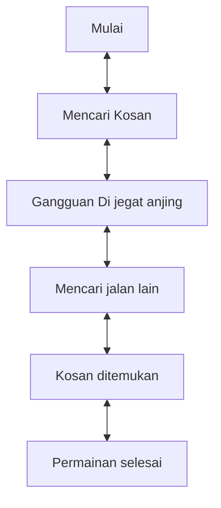

# Game "Life Go"
## 1. Latar Belakang
  
 Game merupakan media hiburan yang dapat di gunakan untuk setiap orang dan dapat digunakan untuk menghilangkan rasa jenuh. Mengapa game ini diberikan nama "life Go" Game ini dibuat oleh saya karena teringat oleh game yang pernah saya mainkan saat saya kecil terutama waktu saya SD dan game yang saya kembangkan ini terinspirasi dari game yang bernama "Mario Bross". 

 
## 2. Deksripsi
  Game Life Go
 
 
## 2. Deksripsi
  Game "Mencari Kosan" ini merupakan game sederhana yang sangat seru dan menyenangkan. Game ini bercerita tentang seorang yang sedang mencari kosan di suatu daerah untuk dapat berteduh. Pada Saat sedang diperjalanan untuk mencari kosan, ia dijegat oleh seekor anjing. Mau ga mau ia harus mencari jalan lain agar menemukan kosan tersebut, Dan pada akhir nya ia menemukan kosan setelah melalui banyak rintangan. Inti dari game ini player dapat melakukan atau mencari kosan yang dia tempati untuk berteduh. Game ini disarankan pada player untuk memainkan game sederhana ini agar tidak bosan.

## 3. Branding
### A. Nama/Merk Game :
Mencari Kosan
### B. Deskripsi Target User :
- Usia 10 tahun ke atas
- Seorang yang mencari hiburan saat bermain game
### C. Genre :
- Simulation

## 4. User Story

Sebagai | Saya Ingin Bisa | Sehingga | Prioritas
---|---|---|---
Pengguna | Memulai permainan | Bisa Bermain | ⭐⭐⭐⭐⭐
Pengguna | Mengarahkan Player untuk mencari kosan | Bisa menemukan kosan | ⭐⭐⭐⭐⭐
Player | Berjalan menuju kosan | Bisa Berteduh dan beristirahat | ⭐⭐⭐⭐⭐
Player | Menghindari seekor anjing | Bisa menemukan kosan | ⭐⭐⭐⭐
Player | Menemukan jalan lain | Bisa terhindar dari kejaran seekor anjing | ⭐⭐⭐⭐
Player | Menemukan kosan | Bisa untuk beristirahat | ⭐⭐⭐⭐⭐

## 5. Desain User Interface
https://www.figma.com/file/LNOMWR9T1boZuDXyCKeoK6/dowi-game-mencari-kosan?type=design&node-id=0-1&mode=design&t=zVyCFd8RaD85Pz1Z-0

## 6. Flowchart dari Algoritma

## 7. Link demo game di youtube

[In Progress]

## 8. Link folder kode pemrograman dari game

[In Progress]

## 9. Game menerapkan prinsip-prinsip dasar pemrograman seperti

   - Variable
   - Data Type
   - Operator
   - Boolean
   - Conditions: if / else / switch
   - Looping: while / for
   - Array
   - Method
   - Class

